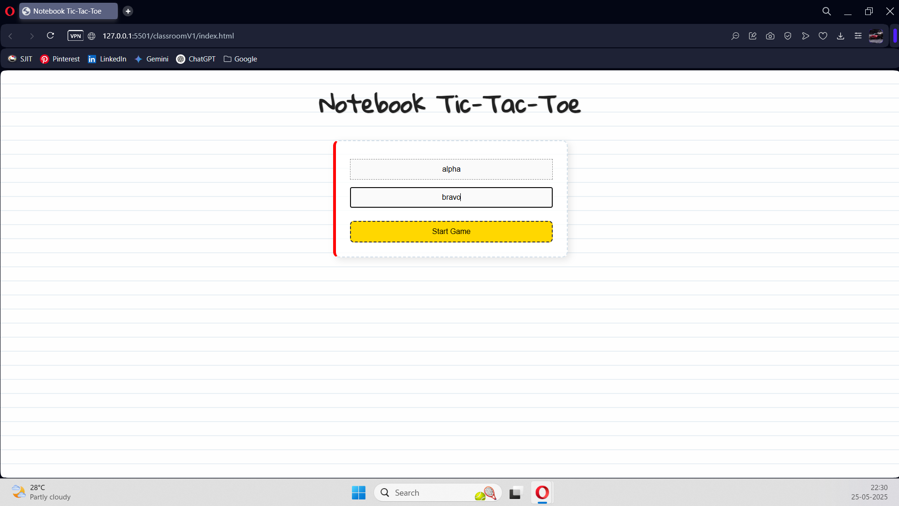

# Notebook Tic-Tac-Toe ✏️📓

Welcome to **Notebook Tic-Tac-Toe**, a fun, web-based twist on the classic Tic-Tac-Toe game — designed to bring back those warm, fuzzy memories of school days! Imagine doodling on your notebook during class, with lined paper backgrounds and playful handwritten fonts, all wrapped up in a simple, addictive game. Let’s jump right in!

---

## 👀 Overview

Tic-Tac-Toe is a timeless two-player game played on a 3x3 grid. Take turns placing your marks ('X' or 'O') and race to get three in a row — horizontally, vertically, or diagonally. Fill the board without a winner, and the game ends in a draw. Simple, yet endlessly fun!

---

## ✨ Key Features

- 🕹️ **Classic Gameplay:** Two players alternate placing X’s and O’s to align three in a row.  
- 📝 **Personal Touch:** Enter your own names to make the game truly yours.  
- 📊 **Score Tracking:** Keep track of wins with a dynamic scoreboard.  
- 🔄 **Smooth Gameplay:** Board resets after each round — keep the fun going!  
- 📚 **Nostalgic Notebook Theme:** Lined paper backgrounds + handwritten fonts = instant school vibes.  
- 🎨 **Clean & Inviting UI:** Easy buttons for starting and resetting the game.  
- 🚫 **Smart Input Validation:** No cheating by clicking occupied cells!  
- 🏆 **Win & Draw Alerts:** Know exactly when you win or tie.  
- ⚡ **Lightweight & Simple:** Built with plain HTML, CSS, and JavaScript — perfect for learning and tweaking.

---

## 🎨 User Interface & Design

- 📃 The background mimics lined notebook paper using a repeating linear gradient.  
- ✍️ The font choice — *‘Gloria Hallelujah’* — gives you that authentic handwritten vibe from Google Fonts.  
- 📏 The game container sports a dashed border with a classic red notebook margin on the left.  
- 🔲 Input boxes and buttons have dashed borders and subtle hover effects for that casual school-day feel.  
- 🔵🔴 Game cells change color depending on the player — blue for X, red for O.  
- 🏅 The scoreboard updates dynamically with clear, readable fonts for quick score checks.

---

## ⚙️ How It Works

### 🛠️ Game Setup

- Players enter their names and hit **Start Game**.  
- The 3x3 grid appears, fresh and ready.  
- The scoreboard displays player names and zeroed scores.

### 🎮 Gameplay

- Take turns clicking empty cells to place your mark (X or O).  
- Can’t place a mark where one already exists — no sneaky moves here!  
- After every move, the game checks for a winner or a draw.  
- When someone wins, an alert announces the champion, and the scoreboard updates.  
- If no one wins and the board fills, the game calls a draw.  
- Board resets automatically to keep the fun rolling, scores stay intact.

### 🔄 Resetting the Game

- Click **Reset Game** to clear scores and start fresh.  
- Player names stay visible but you’ll need to start a new game.

---

## 🛠️ Technology Stack

- **HTML5:** Structure and content.  
- **CSS3:** Styling the notebook vibe and interactive elements.  
- **Vanilla JavaScript:** Game logic, UI updates, and state management.  
- **Google Fonts:** *‘Gloria Hallelujah’* for that handwritten touch.

---

## 💡 Why This Project?

This isn’t just any Tic-Tac-Toe — it’s a heartwarming throwback to your school days, wrapped in a cozy, handwritten notebook style. It’s:

- Perfect for beginners wanting to build interactive web apps.  
- A quick, fun game for everyone to enjoy.  
- A nostalgic trip for those who love school-themed projects.

---

## 📸 Game Screenshots

---

## 🎉 Conclusion

Thank you for exploring **Notebook Tic-Tac-Toe**! I hope this project brings back some great memories and inspires you to create your own playful, meaningful web apps. Whether you’re here to learn, play, or customize, savor every step of the journey. Keep coding, dreaming, and most importantly—keep having fun!

**Happy gaming and happy coding!** 🎉✏️📓
